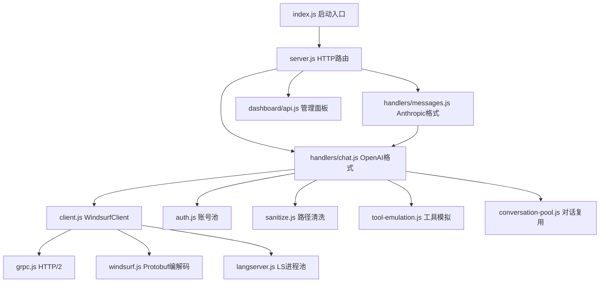

# WindsurfAPI 项目代码逻辑深度分析

## 一、项目概述

WindsurfAPI 是一个 **零依赖 Node.js 反向代理服务**，将 Windsurf（原 Codeium）的内部 AI 模型（107+）转化为 **OpenAI + Anthropic 双协议 API**。

```
用户 (OpenAI/Anthropic SDK) → WindsurfAPI (HTTP:3003) → Language Server (gRPC) → Windsurf 云端
```

**核心模块关系：**


---

## 二、虚拟目录/路径逻辑分析 ★ 重点

### 2.1 `/tmp/windsurf-workspace` — 虚拟工作空间

| 文件 | 行号 | 行为 |
|------|------|------|
| [index.js](file:///D:/Project/WindsurfAPI/src/index.js#L69) | 69 | 启动时 `rm -rf /tmp/windsurf-workspace/*` 清空 |
| [client.js](file:///D:/Project/WindsurfAPI/src/client.js#L172) | 172 | `workspacePath = /home/user/projects/workspace-${wsId}` |
| [sanitize.js](file:///D:/Project/WindsurfAPI/src/sanitize.js#L29) | 29 | 正则替换 `/tmp/windsurf-workspace/...` → `./...` |

#### 分析结论

> [!IMPORTANT]
> **虚拟工作空间路径是合理设计，但存在跨平台问题。**

1. **为什么需要虚拟目录？** Cascade 内部协议要求 `AddTrackedWorkspace` 传入一个文件系统路径。LS 进程会在该路径上执行内置工具（edit_file, view_file 等）。API 代理不需要真实文件操作，所以用虚拟路径是正确策略。

2. **`/tmp/windsurf-workspace` 清空逻辑（index.js:69）**
   ```js
   execSync('mkdir -p /opt/windsurf/data/db /tmp/windsurf-workspace && rm -rf /tmp/windsurf-workspace/* ...');
   ```
   > [!WARNING]
   > **硬编码 Unix 命令，Windows 直接失败。** 虽然代码在 L39 有 `process.platform !== 'win32'` 保护 LS 安装，但清空 workspace 没有任何平台检查——`mkdir -p` 和 `rm -rf` 是 Unix 命令。不过由于整行包在 `try {} catch {}` 里，Windows 上只是静默失败，不影响运行（LS 本身也不支持 Windows）。

3. **`/home/user/projects/workspace-${wsId}`（client.js:172）**
   - `wsId` 取自 `this.apiKey.slice(0, 8).replace(/[^a-z0-9]/gi, 'x')`
   - 每个账号生成独立虚拟路径 → **正确**，避免多账号共享 workspace 导致状态污染。
   - 这个路径从不创建在物理磁盘上——它只是传给 LS 的 gRPC 参数，用于 Cascade 内部上下文。

### 2.2 `/opt/windsurf/data` — LS 数据目录

| 文件 | 行号 | 行为 |
|------|------|------|
| [langserver.js](file:///D:/Project/WindsurfAPI/src/langserver.js#L24) | 24 | `DEFAULT_DATA_ROOT = '/opt/windsurf/data'` |
| [langserver.js](file:///D:/Project/WindsurfAPI/src/langserver.js#L46-L51) | 46-51 | `dataDirForKey()` 使用 `LS_DATA_DIR` 环境变量或默认值 |

#### 分析结论

- 每个 proxy key 有独立子目录（`/opt/windsurf/data/default`, `/opt/windsurf/data/px_1_2_3_4_8080`），用 `mkdirSync({recursive: true})` 创建 → **正确设计**。
- `proxyKey()` 做了安全字符过滤 `proxy.host.replace(/[^a-zA-Z0-9]/g, '_')` → **合理**，防止 host 中的特殊字符注入文件系统路径。

### 2.3 Sanitize — 路径清洗三层防护

[sanitize.js](file:///D:/Project/WindsurfAPI/src/sanitize.js) 实现了三层清洗：

| 模式 | 正则 | 替换为 | 目的 |
|------|------|--------|------|
| `/tmp/windsurf-workspace/...` | `\/tmp\/windsurf-workspace(\/[^\s"'...]*)?` | `.$1` | 保持相对路径可读 |
| `/home/user/projects/workspace-xxx/...` | 同上 | `.$1` | Cascade sandbox 路径 |
| `/opt/windsurf/...` | 同上 | `[internal]` | LS 安装路径 |
| `/root/WindsurfAPI/...` | 同上 | `[internal]` | 项目部署路径 |

> [!TIP]
> **流式清洗器 `PathSanitizeStream` 设计精妙。** 它维护一个内部缓冲区，通过 `_safeCutPoint()` 计算安全截断点——任何可能是敏感路径前缀的尾部都被保留到下次 `feed()`，确保跨 chunk 边界的路径不会泄漏。这个实现是正确的。

> [!WARNING]
> **潜在遗漏：** 清洗模式是硬编码的。如果部署环境不是 `/root/WindsurfAPI` 或 `/opt/windsurf`（比如用户装在 `/home/ubuntu/WindsurfAPI`），则项目路径可能泄漏。建议动态生成 `REPO_ROOT` 的正则。

---

## 三、核心逻辑正确性分析

### 3.1 Protobuf 编解码（proto.js + windsurf.js）

> [!NOTE]
> **手工实现的 Protobuf 编解码器，无 schema 文件依赖。质量很高。**

- `encodeVarint` 正确处理了 BigInt 路径（负数、>2^31 值）
- `decodeVarint` 用快速路径（<28 bits → Number）+ 慢速路径（BigInt），避免不必要的 BigInt 开销
- `parseFields` 正确支持全部 4 种 wire type（varint/fixed64/len-delim/fixed32）
- **未处理的边界情况：** wire type 3/4（start/end group）在 proto3 中已废弃，抛出错误是正确行为

### 3.2 Cascade 流程（client.js `cascadeChat`）

**流程：**
```
warmupCascade() → StartCascade → SendUserCascadeMessage → Poll GetCascadeTrajectorySteps → 收集 text/thinking/toolCalls
```

#### 正确的点：
- ✅ per-step text cursor（`yieldedByStep` Map）而非全局 cursor → 解决了多步骤回复丢失问题
- ✅ `responseText` vs `modifiedText` 优先级处理 → 流式用 `responseText`（单调递增），最终用 `modifiedText`（LS 润色版）
- ✅ 冷启动检测（`sawActive + !sawText` 超过阈值 → stall）
- ✅ 热停滞检测（text 不增长 > 25s → stall）同时考虑 thinking 增长
- ✅ panel state 丢失自动恢复（`isPanelMissing` → 重新 warmupCascade）

#### 存疑的点：

> [!WARNING]
> **1. `reuseEntry` 参数在 `cascadeChat` 内部被重新赋值**（[client.js:255](file:///D:/Project/WindsurfAPI/src/client.js#L255)）
> ```js
> reuseEntry = null; // cascade expired — treat as fresh
> ```
> 但 `reuseEntry` 是解构传入的 `opts.reuseEntry`，这里重新赋值只影响局部变量。**这是正确的**——它不会影响调用方的 `opts` 对象。但代码可读性差，容易误解为 mutation。

> [!WARNING]
> **2. 多轮历史打包的截断逻辑（[client.js:285-303](file:///D:/Project/WindsurfAPI/src/client.js#L285-L303)）**
> ```js
> const maxHistoryBytes = cascadeHistoryBudget(modelUid);
> for (let i = convo.length - 2; i >= 0; i--) {
>   ...
>   if (historyBytes + line.length > maxHistoryBytes && lines.length > 0) {
>     break;
>   }
> ```
> 这里从最新的历史往回装，超出预算就截断。**逻辑正确**，但有个细节：`contentToString(m.content)` 可能包含 base64 图片数据（如果 `content` 是 array），这些不应该占历史预算。实际上 `extractImages` 只在最后一条消息上调用，之前的图片内容会作为文本被包含进去。

> [!CAUTION]
> **3. `neutralizeIdentityForCascade` 的正则过于简单（[client.js:51](file:///D:/Project/WindsurfAPI/src/client.js#L51)）**
> ```js
> sysText.replace(/(^|[\n.!?]\s*)You are /g, '$1The assistant is ')
> ```
> 只替换句首的 "You are "。如果系统提示写成 "Remember: You are Claude"（没有句号/换行前缀），则不会被替换，仍可能触发 Cascade 的反注入保护。不过注释中说明了这是有意为之——只改句首形式，降低误伤。

### 3.3 账号池与轮询（auth.js）

- ✅ **RPM 滑动窗口** — `_rpmHistory` 数组 + 60s 剪枝 → 正确
- ✅ **in-flight 计数器** — `getApiKey` +1 / `releaseAccount` -1 → 正确，且有 `Math.max(0, ...)` 防下溢
- ✅ **原子写入** — `writeFileSync(tempFile)` + `renameSync` → POSIX 原子，Windows 也正常（覆盖行为）
- ✅ **保存序列化** — `_saveInFlight` + `_savePending` 防止并发写入

> [!WARNING]
> **`saveAccounts()` 的 `setImmediate` 重入**
> ```js
> finally {
>   _saveInFlight = false;
>   if (_savePending) { _savePending = false; setImmediate(saveAccounts); }
> }
> ```
> 如果高频更新（例如 probe 10 个账号），每次 `reportSuccess` 都调 `updateCapability` → `saveAccounts`，最多只会排队一次（`_savePending` 被合并）。**正确设计，不会无限递归。**

### 3.4 gRPC 会话池（grpc.js）

- ✅ **复用 HTTP/2 session** — 避免了每次请求新建 TCP 连接
- ✅ **双重 settle 保护** — `grpcUnary` 和 `grpcStream` 都有 `settled` flag 防止 resolve+reject 同时触发
- ✅ **unref()** — 空闲 session 不阻止 Node 进程退出
- ✅ **session 错误/关闭自动清理** — `_sessionPool.delete(key)` 条件检查 `session === current`

> [!NOTE]
> **gRPC 帧重组** — `extractGrpcFrames` + `Buffer.concat(frames)` 处理 chunked 响应。`grpcUnary` 在 `'end'` 事件中做此操作。**正确**。

### 3.5 Anthropic 协议翻译（handlers/messages.js）

- ✅ `anthropicToOpenAI` 正确处理 system/user/assistant/tool_use/tool_result/thinking 块
- ✅ `AnthropicStreamTranslator` 实现了完整的 SSE 事件流（message_start → content_block_start/delta/stop → message_delta → message_stop）
- ✅ `createCaptureRes` 伪造 `ServerResponse` 接口，透传心跳（`: ping\n\n`）

> [!WARNING]
> **`anthropicToOpenAI` 对 image 块的处理（L71-74）** — 图片和文本混合时，图片作为 `contentArr` 的前面、文本在后面。但 OpenAI 格式要求 `image_url` type 的 content part，而这里直接传入了 Anthropic 的 `block` 对象（`type: 'image'`）。下游的 `extractImages()` 会处理这个，但格式不严格符合 OpenAI spec。**实际不影响功能**（下游只看 `type` 字段）。

### 3.6 工具模拟（handlers/tool-emulation.js）

- ✅ **双层注入** — proto 层面（`additional_instructions_section` field 12）+ 用户消息层面（最后一条 user 消息追加）
- ✅ **流式解析器 `ToolCallStreamParser`** — 正确处理跨 chunk 的 `<tool_call>`/`</tool_call>` 标签、部分前缀保留、65KB 溢出保护
- ✅ **tool_choice 支持** — auto/required/none/specific function

> [!NOTE]
> **bare JSON tool call 解析** — 除了 `<tool_call>` 标签，还支持裸 JSON `{"name":"...","arguments":{...}}` 和 `{"tool_code":"func(args)"}` 两种变体。这是对不同模型输出格式的防御性兼容，设计合理。

---

## 四、发现的具体问题

### 🔴 严重度：高

#### 4.1 streaming 路径中 `reqId` 未定义（chat.js:791）

```js
// chat.js L791 (在 streamResponse 内的 handler 闭包中)
log.info(`Chat[${reqId}]: reuse MISS — owning account not available after 5s wait`);
```

`reqId` 是在 `handleChatCompletions()` 的 L157 定义的局部变量，但 `streamResponse()` 是一个独立函数（L603），它通过参数接收数据但 **没有接收 `reqId`**。`reqId` 在 `streamResponse` 的 `handler` 闭包中是 **未定义的**（`undefined`）。

> 同一问题也出现在 L823, L926 等多处。

**影响：** 日志中打印 `Chat[undefined]`，不影响功能但不利于调试。

#### 4.2 `buildAddTrackedWorkspaceRequest` 未使用 metadata（windsurf.js:273）

```js
export function buildAddTrackedWorkspaceRequest(apiKey, workspacePath, sessionId) {
  return writeStringField(1, workspacePath);
}
```

签名接收 `apiKey` 和 `sessionId`，但函数体完全不使用它们——只编码了 `workspacePath` 字段。注释说 "AddTrackedWorkspaceRequest has a single field: workspace"，所以参数是多余的。

**影响：** 无功能影响，但容易误导开发者以为 metadata 被编码了。

### 🟡 严重度：中

#### 4.3 Windows 平台的 LS 工作空间清理静默失败

[index.js:69](file:///D:/Project/WindsurfAPI/src/index.js#L69) — `execSync('mkdir -p ... && rm -rf ...')` 在 Windows 上会进入 `catch {}` 空块。虽然 LS 不支持 Windows 所以整个块不执行（L62 有 `existsSync(binaryPath)` 保护），但如果用户在 WSL 中运行并设置了 Windows 路径的 `LS_BINARY_PATH`，就可能出问题。

#### 4.4 `config.js` 的 `.env` 解析不处理行内注释

```js
// config.js L19
let val = trimmed.slice(eqIdx + 1).trim();
```

如果 `.env` 中有 `PORT=3003 # 端口`，val 会是 `3003 # 端口`，`parseInt` 会只取 `3003`（因为 `parseInt` 忽略尾部非数字字符）。但对字符串值（如 `API_KEY=mykey # secret`）会保留注释部分。

**影响：** API_KEY 可能包含意外的注释文本。

#### 4.5 `conversation-pool.js` 的 META_TAG 正则使用了双重转义

```js
// conversation-pool.js L61
const META_TAG_RE = new RegExp(
  `<(${META_TAG_NAMES.join('|')})[^>]*>[\\s\\S]*?</\\1>`, 'g'
);
```

在 template literal 中 `\\s` 实际产生的正则是 `\s`（正确），`\\1` 产生 `\1`（正确的反向引用）。**实际是正确的**——在 `new RegExp()` 的字符串参数中需要双重转义。

#### 4.6 `streamResponse` 中 `accText`/`accThinking` 在 retry 时不重置

```js
// chat.js L675-676
let accText = '';
let accThinking = '';
```

如果第一个账号失败但部分输出了内容（`hadSuccess=true`），不会进入重试。但如果 `hadSuccess=false` 且进入下一次循环，`accText` 保留了上一次失败的残余。不过由于 `hadSuccess=false` 时这些残余为空（没有 `onChunk` 被调用），所以 **实际无影响**。

### 🟢 严重度：低

#### 4.7 `models.js` 中 `ALL_MODEL_KEYS` 未被引用

```js
// models.js L305
const ALL_MODEL_KEYS = Object.keys(MODELS);
```

定义后从未使用。`MODEL_TIER_ACCESS.pro` 用 getter 动态获取 `Object.keys(MODELS)`。

#### 4.8 `cache.js` 的 `normalize()` 包含 `messages` 全文

```js
// cache.js L24
messages: body.messages || [],
```

如果 messages 包含 base64 图片，cache key 的 SHA256 计算会处理巨大的字符串。**不影响正确性，但影响性能。**

#### 4.9 `VERSION_INFO` 在 server.js 和 index.js 中重复计算

`server.js:33-47` 和 `index.js:14-19` 都独立读取 `package.json` 版本。虽然结果一致，但逻辑重复。`index.js` 已 export `VERSION`，`server.js` 可直接 import。

---

## 五、安全相关审查

| 项目 | 状态 | 备注 |
|------|------|------|
| 路径遍历防护 | ✅ | `proxyKey()` 过滤特殊字符 |
| 请求体大小限制 | ✅ | `MAX_BODY_SIZE = 10MB` |
| gRPC 帧大小限制 | ✅ | `>100MB` 中止连接 |
| Prototype pollution | ✅ | `deepMerge()` 过滤 `__proto__/constructor/prototype` |
| SSRF 防护 | ✅ | `image.js` 检查私有 IP + DNS rebinding 防护 |
| API Key 验证 | ✅ | Dashboard API 不需要 key，其他 API 都需要 |
| XSS（dashboard） | ⚠️ | 未审查 dashboard HTML，可能存在 |
| Shell 注入 | ✅ | `execSync` 只在 install-ls.sh 调用中使用，路径来自 `import.meta.url` |

---

## 六、总结评级

| 维度 | 评级 | 说明 |
|------|------|------|
| 架构设计 | ⭐⭐⭐⭐⭐ | 模块划分清晰，零依赖实现完整 gRPC/Protobuf/SSE 栈 |
| 路径/目录逻辑 | ⭐⭐⭐⭐ | 虚拟目录策略正确，清洗器设计精妙，但清洗模式硬编码 |
| 错误处理 | ⭐⭐⭐⭐ | 多层 retry + stall 检测 + graceful shutdown 做得很好 |
| 并发安全 | ⭐⭐⭐⭐ | `_pending` 合并、`settled` flag、`_saveInFlight` 互斥都正确 |
| 跨平台兼容 | ⭐⭐⭐ | Linux 为主，macOS 有部分支持，Windows 基本不行（LS 不支持） |
| 代码质量 | ⭐⭐⭐⭐ | 注释详尽，变量命名清晰，但有少量死代码和重复逻辑 |

> [!IMPORTANT]
> **整体结论：这是一个工程质量相当高的项目。** 核心逻辑（Protobuf 编解码、Cascade 轮询、路径清洗、账号池管理）都经过仔细设计并处理了大量边界情况。发现的问题主要是非功能性的（日志中的 undefined、死代码、.env 行内注释），没有发现会导致请求失败或数据损坏的严重逻辑错误。
